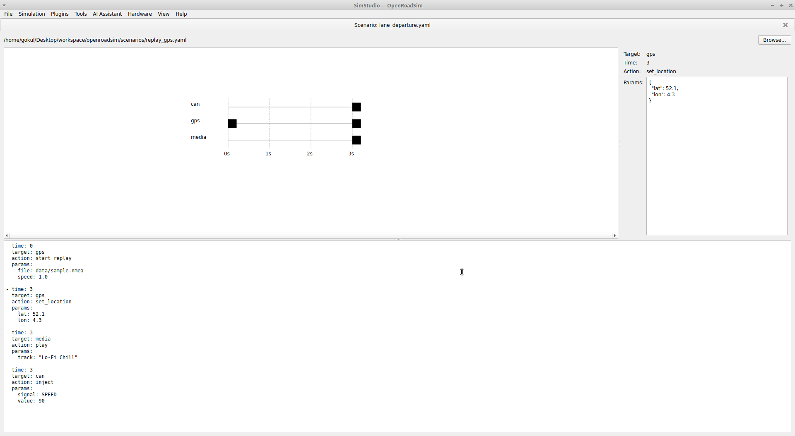

# OpenRoadSim

**OpenRoadSim** is a proposed open-source simulation framework for integrated validation of automotive infotainment systems and signal-level domains. Built for accessibility and extensibility, OpenRoadSim enables developers to simulate and test complex, cross-domain vehicle interactions—including GPS, CAN bus, media playback, ADAS, and voice interaction—on standard laptops. Please refer the White Paper I wrote about this project : [Academia.edu – OpenRoadSim](https://www.academia.edu/129633780/OpenRoadSim_A_Proposal_for_an_Open_Source_Framework_for_Automotive_Infotainment_and_Signal_Simulation)

**API** Guide: https://karthagokul.github.io/openroadsim/ 

**Plugin Development** Guide : https://karthagokul.github.io/openroadsim/plugins/

# Installation & First run

you shall use Ubuntu 20.04 or later with python3 . Run the below commands  

    pip install -r requirements.txt
    python main.py scenarios/echo_test.yaml

you shall see logs like below
 

        gokul@techysaint:~/Desktop/workspace/openroadsim$ python3 main.py scenarios/example.yaml
        [22:55:08] [Main] [INFO] OpenRoadSim — Phase 1 Starting Up
        [22:55:08] [Main] [INFO] Loading plugins from 'plugins'
        [22:55:08] [EchoPlugin] [INFO] Initialized.
        [22:55:08] [Main] [INFO] Loaded plugin 'EchoPlugin'
        [22:55:08] [Main] [INFO] Starting scenario with 2 event(s).
        [22:55:08] [EchoPlugin] [INFO] [0.000s] Echoed: Hello, OpenRoadSim!
        [22:55:10] [EchoPlugin] [INFO] [2.000s] Echoed: Event-driven architecture works!
        [22:55:10] [Main] [INFO] Scenario completed.
        [22:55:10] [EchoPlugin] [INFO] Shutting down.
        [22:55:10] [Main] [INFO] Simulation complete. Goodbye!
        gokul@techysaint:~/Desktop/workspace/openroadsim$

## License
    #
    # MIT License
    # Copyright (c) 2024 Gokul Kartha
    # Permission is hereby granted, free of charge, to any person obtaining a copy
    # of this software and associated documentation files (the "Software"), to deal
    # in the Software without restriction, including without limitation the rights
    # to use, copy, modify, merge, publish, distribute, sublicense, and/or sell
    # copies of the Software, and to permit persons to whom the Software is
    # furnished to do so, subject to the following conditions:
    # The above copyright notice and this permission notice shall be included in all
    # copies or substantial portions of the Software.
    # THE SOFTWARE IS PROVIDED "AS IS", WITHOUT WARRANTY OF ANY KIND, EXPRESS OR
    # IMPLIED, INCLUDING BUT NOT LIMITED TO THE WARRANTIES OF MERCHANTABILITY,
    # FITNESS FOR A PARTICULAR PURPOSE AND NONINFRINGEMENT. IN NO EVENT SHALL THE
    # AUTHORS OR COPYRIGHT HOLDERS BE LIABLE FOR ANY CLAIM, DAMAGES OR OTHER
    # LIABILITY, WHETHER IN AN ACTION OF CONTRACT, TORT OR OTHERWISE, ARISING FROM,
    # OUT OF OR IN CONNECTION WITH THE SOFTWARE OR THE USE OR OTHER DEALINGS IN THE
    # SOFTWARE.
    #

## Overview
 Modern vehicles rely heavily on software for features ranging from navigation to driver assistance. However, validating these systems often requires expensive, closed, and fragmented simulation platforms.
**OpenRoadSim** addresses this challenge by providing:
- A **modular, plugin-based architecture**
- A graphical IDE called **SimStudio**
- A human-readable **scenario scripting language**
-  **LLM integration** for AI-assisted scenario creation
- Optional support for **real hardware-in-the-loop (HIL)** testing

## SimStudio – Visual Scenario Designer
SimStudio is a built-in GUI tool for OpenRoadSim that helps you create, visualize, and inspect simulation scenarios with ease. Built using PyQt5, it provides a modular interface featuring a timeline view of events, a property inspector to edit individual actions, and a YAML editor to modify the raw scenario file. The interface includes menus for managing simulation runs, loading plugins, inspecting signals, injecting events, and connecting to hardware like USB-CAN or GPS devices. Tools like the CAN Viewer, Signal Inspector, Scenario Editor, and Metrics Viewer are being added progressively as part of the roadmap. The UI will continue to evolve over time with a focus on usability and developer productivity.
Note: Under development , UI will be fully functional over next releases

### Features
- Timeline View — Visualize simulation events over time
- Scenario Inspector — View and edit event details in a side panel
- YAML Editor — Edit the raw scenario file with live preview
- Click-to-Inspect — Click on event markers to inspect & modify actions
- Load / Save / Reload scenarios with full file tracking

### How to Launch SimStudio ?

    python simstudio/main.py

### Sequence Highlevel Overview

## Key Capabilities
 
-  **Plugin System**: Each subsystem (e.g., CAN, GPS, ADAS) runs as an independent plugin.
-  **AI Support**: Natural language scenario generation using large language models.
-  **SimStudio IDE**: Visual timeline editor, signal viewer, live log console.
-  **Scenario Scripting**: YAML-based scenarios with timing, conditions, and loops.
-  **Hardware Integration**: Supports USB-CAN, GPS dongles, Android IVI devices.
-  **Community Ready**: Built for collaboration, customization, and open contribution.

## Development Roadmap
1. Core engine, scripting, and CLI interface
2. SimStudio IDE and developer tools
3. Reference plugins (CAN, GPS, media, voice)
4. LLM integration and developer copilot
5. HIL capabilities and remote simulation
6. Plugin registry and scenario library 

## Documentation (Coming Soon)
- White Paper: [Academia.edu – OpenRoadSim](https://www.academia.edu/129633780/OpenRoadSim_A_Proposal_for_an_Open_Source_Framework_for_Automotive_Infotainment_and_Signal_Simulation)
- [Developer Docs & SDK Guides](https://karthagokul.github.io/openroadsim/)
- [Community Plugin Guidelines](https://karthagokul.github.io/openroadsim/)

## Get Involved
OpenRoadSim is in active proposal and planning phase. Contributors, researchers, and early testers are welcome.
> [LinkedIn](https://www.linkedin.com/in/gokulkartha/)
